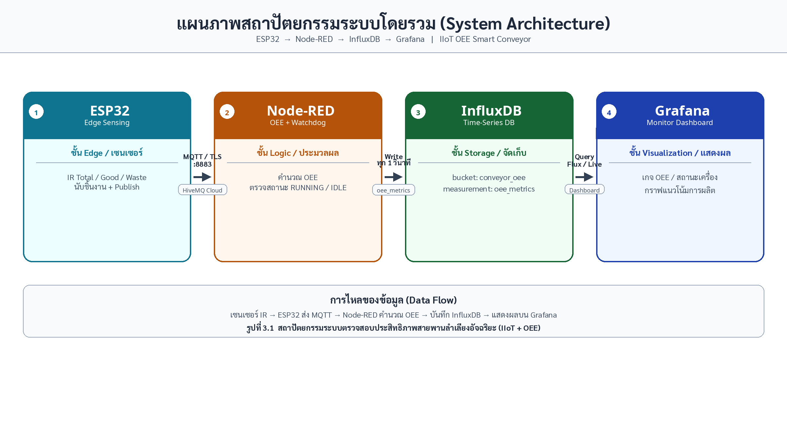

# เอกสารโปรเจค: IIoT OEE Monitoring Dashboard

**ชื่อโปรเจค (ไทย):** ระบบตรวจสอบประสิทธิภาพสายพานลำเลียงอัจฉริยะแบบเรียลไทม์ด้วยสถาปัตยกรรม IIoT และดัชนี OEE  
**ชื่อโปรเจค (อังกฤษ):** Smart Conveyor Belt Real-Time OEE Monitoring Dashboard using IIoT  
**เวอร์ชันปัจจุบัน:** 8.3  
**ระดับการศึกษาที่เหมาะ:** ปวส. (สาขาอิเล็กทรอนิกส์ / เมคคาทรอนิกส์ / IoT / เทคโนโลยีสารสนเทศอุตสาหกรรม)  
**ประเภทโปรเจค:** โปรเจคจบ / โปรเจคสาธิตระบบอุตสาหกรรมขนาดย่อม

> **แนะนำ:** หากต้องการโครงรายงานแบบแยกบท (บทที่ 1–5 + ภาคผนวก) ให้ใช้สารบัญที่ [`README.md`](./README.md)

| บท | ลิงก์ |
| --- | --- |
| บทที่ 1 บทนำ | [บทที่-01-บทนำ.md](./บทที่-01-บทนำ.md) |
| บทที่ 2 ทฤษฎีและงานที่เกี่ยวข้อง | [บทที่-02-ทฤษฎีและงานที่เกี่ยวข้อง.md](./บทที่-02-ทฤษฎีและงานที่เกี่ยวข้อง.md) |
| บทที่ 3 วิธีการดำเนินงาน | [บทที่-03-วิธีการดำเนินงาน.md](./บทที่-03-วิธีการดำเนินงาน.md) |
| บทที่ 4 ผลการดำเนินงานและการทดสอบ | [บทที่-04-ผลการดำเนินงานและการทดสอบ.md](./บทที่-04-ผลการดำเนินงานและการทดสอบ.md) |
| บทที่ 5 สรุปและข้อเสนอแนะ | [บทที่-05-สรุปและข้อเสนอแนะ.md](./บทที่-05-สรุปและข้อเสนอแนะ.md) |
| ภาคผนวก | [ภาคผนวก.md](./ภาคผนวก.md) |

ด้านล่างนี้เป็นเอกสารรวมเล่มฉบับเดียว (อ่านรวดเดียวจบ)

---

## 1. สรุปย่อ (Executive Summary)

โปรเจคนี้สร้างแบบจำลองสายพานลำเลียงอัจฉริยะที่นับชิ้นงานด้วยเซนเซอร์อินฟราเรด (IR) ผ่านไมโครคอนโทรลเลอร์ ESP32 ส่งข้อมูลขึ้นคลาวด์ด้วย MQTT จากนั้นประมวลผลดัชนีประสิทธิผลโดยรวมของเครื่องจักร (**OEE**) ที่ Node-RED เก็บข้อมูลอนุกรมเวลาใน InfluxDB และแสดงผลแบบเรียลไทม์บน Grafana

จุดเด่นคือครบวงจรตั้งแต่ฮาร์ดแวร์หน้างานจนถึง Dashboard มาตรฐานอุตสาหกรรม ไม่ได้หยุดแค่ “ส่งค่าเซนเซอร์ขึ้นจอ” แต่คำนวณตัวชี้วัดที่ใช้จริงในโรงงานได้

---

## 2. กลุ่มเป้าหมาย (Target Audience)

| กลุ่ม | ทำไมต้องสนใจโปรเจคนี้ |
| --- | --- |
| **นักศึกษา ปวส.** สาขาอิเล็กฯ / เมคคาทรอนิกส์ / IoT | ใช้เป็นโปรเจคจบที่โชว์ทักษะฮาร์ดแวร์ + คลาวด์ + Dashboard ในชิ้นเดียว |
| **อาจารย์ที่ปรึกษา / กรรมการสอบ** | ประเมินความครบของระบบ ความเข้าใจ OEE และการสาธิตผลจริง |
| **ผู้เรียนวิชา IIoT / Automation** | เป็นเคสศึกษาสถาปัตยกรรม Sensor → Edge → Cloud → Visualize |
| **โรงงานขนาดเล็ก / ห้องแล็บสาธิต** | เป็นต้นแบบระบบมอนิเตอร์สายพานราคาประหยัดก่อนขยายจริง |
| **ผู้สัมภาษณ์งานช่างเทคนิค / IoT Technician** | ใช้พอร์ตโฟลิโออธิบายประสบการณ์ระบบอุตสาหกรรมจริง |

**ไม่ใช่กลุ่มเป้าหมายหลัก**
- โรงงานขนาดใหญ่ที่ต้องการระบบ SCADA/MES เต็มรูปแบบ (โปรเจคนี้เป็นโมเดลสาธิต ไม่ใช่ระบบ production-grade)
- ผู้ใช้ทั่วไปที่ไม่มีพื้นฐานอิเล็กทรอนิกส์หรือเครือข่ายเบื้องต้น

---

## 3. ความเป็นมาและเหตุผลในการทำ (Background & Motivation)

### 3.1 ปัญหาที่พบ
ในโรงงานหรือสายการผลิตเล็ก ๆ การประเมินประสิทธิภาพเครื่องจักรยังมักทำแบบมือ:
- จดยอดผลิตลงกระดาษหรือสเปรดชีต
- ไม่รู้ทันทีว่าเครื่องหยุดนานแค่ไหน
- ไม่แยกชัดระหว่างปัญหาความพร้อม (Availability) ความเร็ว (Performance) และคุณภาพ (Quality)
- ข้อมูลย้อนหลังวิเคราะห์ยาก เพราะไม่ได้เก็บแบบ time-series

### 3.2 ทำไมต้องทำโปรเจคนี้
1. **ตอบโจทย์อุตสาหกรรม 4.0 / IIoT** — โรงงานต้องการข้อมูลเรียลไทม์เพื่อตัดสินใจเร็วขึ้น  
2. **OEE เป็นตัวชี้วัดมาตรฐาน** — ใช้จริงในงานผลิต จึงเรียนรู้แล้วต่อยอดได้  
3. **เหมาะกับระดับ ปวส.** — ใช้ฮาร์ดแวร์ราคาไม่แพง (ESP32 + IR) แต่สถาปัตยกรรมครบชั้น  
4. **ฝึกทักษะสหวิทยาการ** — อิเล็กทรอนิกส์, การเขียนโปรแกรมฝังตัว, MQTT, Node-RED, ฐานข้อมูล, Dashboard  
5. **สาธิตได้ชัดเจน** — กรรมการเห็นชิ้นงานวิ่ง → ตัวเลขขยับ → กราฟเปลี่ยน ภายในไม่กี่วินาที

### 3.3 คุณค่าทางการศึกษา
นักศึกษาได้ฝึกทั้ง “ลงมือประกอบระบบ” และ “อธิบายหลักการวิศวกรรม” ซึ่งตรงกับสมรรถนะที่ตลาดแรงงานช่างเทคนิคต้องการ

---

## 4. วัตถุประสงค์ของโปรเจค (Objectives)

1. ออกแบบและสร้างแบบจำลองสายพานที่นับชิ้นงาน Total / Good / Waste ด้วยเซนเซอร์ IR  
2. ส่งข้อมูลแบบเรียลไทม์ผ่าน MQTT ไปยังระบบคลาวด์อย่างปลอดภัย (TLS พอร์ต 8883)  
3. คำนวณดัชนี OEE = Availability × Performance × Quality บนระบบหลังบ้าน  
4. ตรวจจับสภาวะเครื่องหยุด (IDLE) อัตโนมัติเมื่อไม่มีชิ้นงานผ่านเกิน 1 นาที  
5. จัดเก็บข้อมูลอนุกรมเวลาและแสดงผลผ่าน Grafana Dashboard  
6. จัดทำเอกสารและขั้นตอนติดตั้งให้ทำซ้ำได้

---

## 5. ขอบเขตของโปรเจค (Scope)

### 5.1 สิ่งที่อยู่ในขอบเขต
- ฮาร์ดแวร์ ESP32 + IR Sensor 3 ตัว (เวอร์ชัน 8.3)
- การสื่อสาร MQTT ผ่าน HiveMQ Cloud
- การคำนวณ OEE และ Watchdog ใน Node-RED
- การบันทึกลง InfluxDB bucket `conveyor_oee`
- Dashboard Grafana สำหรับสถานะเครื่อง, OEE, ยอดผลิต, แนวโน้ม

### 5.2 สิ่งที่อยู่นอกขอบเขต
- การควบคุมคุณภาพอัตโนมัติด้วยกล้อง/AI
- ระบบแจ้งเตือนผ่าน LINE/Email แบบ production
- การเชื่อมต่อ PLC ยี่ห้ออุตสาหกรรมโดยตรง
- การจัดการหลายสายการผลิตพร้อม RBAC ผู้ใช้จำนวนมาก
- การรับรองความปลอดภัยไซเบอร์ระดับโรงงานเต็มรูปแบบ

---

## 6. ประโยชน์ที่คาดว่าจะได้รับ (Expected Benefits)

| ด้าน | ประโยชน์ |
| --- | --- |
| **นักศึกษา** | มีโปรเจคพอร์ตโฟลิโอครบ stack และเข้าใจตัวชี้วัดโรงงาน |
| **สถานศึกษา** | ได้ชุดสาธิต IIoT/OEE สำหรับห้องปฏิบัติการ |
| **แนวคิดโรงงาน** | ลดการจดยอดมือ เห็นสถานะเครื่องและคุณภาพทันที |
| **การเรียนรู้** | เข้าใจการแยกชั้น Edge / Broker / Logic / DB / UI |

---

## 7. ทฤษฎีและหลักการที่ต้องรู้ (Core Knowledge)

### 7.1 OEE (Overall Equipment Effectiveness)
สูตรหลัก:

\[
OEE = Availability \times Performance \times Quality
\]

ในโปรเจคนี้คำนวณโดยประมาณดังนี้:

| ตัวชี้วัด | ความหมาย | การคำนวณในระบบ |
| --- | --- | --- |
| **Availability** | เครื่องพร้อมทำงานจริงมากน้อยแค่ไหน | `runningTime / totalPlannedTime × 100` |
| **Performance** | ผลิตได้เร็วเทียบกับมาตรฐานหรือไม่ | เทียบยอดจริงกับค่าที่ควรได้จาก Ideal Cycle Time = **5 วินาที/ชิ้น** |
| **Quality** | สัดส่วนของดีต่อยอดรวม | `good / total × 100` |

**ตีความคร่าว ๆ (ใช้พูดสอบได้)**
- OEE สูง = เครื่องพร้อม + ผลิตเร็วพอ + ของเสียต่ำ
- OEE ต่ำต้องไล่ดูทีละแกน ว่าเสียที่ความพร้อม ความเร็ว หรือคุณภาพ

### 7.2 IIoT (Industrial Internet of Things)
การเชื่อมอุปกรณ์หน้างานเข้ากับระบบข้อมูล เพื่อมอนิเตอร์/วิเคราะห์แบบต่อเนื่อง  
สถาปัตยกรรมโปรเจคนี้เป็นแบบคลาสสิกของ IIoT ขนาดเล็ก: **Device → Connectivity → Processing → Storage → Visualization**

### 7.3 MQTT
โปรโตคอลเบา เหมาะกับ IoT  
ใช้แบบ Publish/Subscribe:
- ESP32 = Publisher
- Node-RED = Subscriber
- HiveMQ Cloud = Broker

Topics ที่ใช้:
- `factory/conveyor/total`
- `factory/conveyor/good`
- `factory/conveyor/waste`

### 7.4 Watchdog / Idle Detection
ถ้าไม่มีชิ้นงานผ่านเซนเซอร์ใดเลยเกิน **60 วินาที** ระบบเปลี่ยนสถานะเป็น **IDLE/STOPPED**  
เหตุผล: กันการนับว่าเครื่องยังวิ่งทั้งที่ของไม่ไหล ซึ่งจะบิดเบือน Availability/Performance

### 7.5 Debounce
เซนเซอร์ IR อาจกระตุกสั้น ๆ ตอนวัตถุผ่าน  
firmware ใช้หน่วงประมาณ **150 ms** เพื่อไม่ให้นับซ้ำ

---

## 8. สถาปัตยกรรมระบบ (System Architecture)

แผนภาพสถาปัตยกรรมระบบโดยรวม 4 องค์ประกอบหลัก: **ESP32 → Node-RED → InfluxDB → Grafana**



**รูปที่ 3.1** สถาปัตยกรรมระบบตรวจสอบประสิทธิภาพสายพานลำเลียงอัจฉริยะ (IIoT + OEE)

> ไฟล์ PNG สำหรับแทรกใน Microsoft Word: `docs/figures/รูปที่-3.1-สถาปัตยกรรมระบบโดยรวม.png`

รายละเอียดชั้นระบบแบบย่อ (รวม MQTT Broker):

```text
[IR Total] ---+
[IR Good ] ---+--> ESP32 --MQTT/TLS:8883--> HiveMQ Cloud
[IR Waste] ---+                              |
                                             v
                                         Node-RED
                                      (OEE + Watchdog)
                                             |
                             +---------------+---------------+
                             |                               |
                             v                               v
                         InfluxDB v2                    Node-RED UI
                       bucket: conveyor_oee              (gauge/ยอด)
                             |
                             v
                          Grafana
                     (Dashboard OEE)
```

### บทบาทแต่ละชั้น
1. **Edge (ESP32):** อ่านเซนเซอร์ นับชิ้น ส่ง MQTT  
2. **Broker (HiveMQ):** กระจายข้อความตาม topic  
3. **Logic (Node-RED):** คำนวณ OEE, ตรวจ IDLE, จัดรูปแบบข้อมูล  
4. **Storage (InfluxDB):** เก็บข้อมูลตามเวลา  
5. **Visualization (Grafana):** แสดงสถานะและแนวโน้ม

---

## 9. ฮาร์ดแวร์ (Hardware)

### 9.1 รายการอุปกรณ์หลัก (v8.3)
- ESP32 Dev Board
- IR Obstacle Sensor × 3 (Total, Good, Waste)
- สายพานจำลอง / โครงสาธิต
- แหล่งจ่ายไฟเหมาะสมกับบอร์ดและมอเตอร์สายพาน (ถ้ามี)
- Wi-Fi ที่ออกเน็ตได้เพื่อเชื่อม HiveMQ Cloud

### 9.2 ขาพิน (v8.3)

| อุปกรณ์ | GPIO | หน้าที่ |
| --- | --- | --- |
| IR Total | 2 | นับชิ้นงานเข้าสายพาน |
| IR Good | 4 | นับชิ้นงานดีผ่าน QC |
| IR Waste | 5 | นับชิ้นงานเสีย |

### 9.3 หมายเหตุเวอร์ชันเก่า (v3.2)
มีปุ่ม Start/Stop/Reset และรีเลย์มอเตอร์ รวมถึงเซนเซอร์ Total/Waste แบบ 2 จุด  
ใช้ศึกษาวิวัฒนาการระบบได้ แต่เวอร์ชันหลักที่เอกสารนี้อ้างคือ **8.3**

---

## 10. ซอฟต์แวร์และเทคโนโลยี (Software Stack)

| ชั้น | เทคโนโลยี | หน้าที่ |
| --- | --- | --- |
| Firmware | Arduino (C/C++) บน ESP32 | อ่าน IR, debounce, MQTT publish |
| Connectivity | Wi-Fi + MQTT TLS | ส่งข้อมูลขึ้นคลาวด์ |
| Broker | HiveMQ Cloud | ตัวกลางรับ-ส่งข้อความ |
| Backend Logic | Node-RED | คำนวณ OEE + Watchdog |
| Database | InfluxDB v2 | เก็บ time-series |
| Dashboard | Grafana | แสดงผลมอนิเตอร์ |
| Optional UI | Node-RED Dashboard | ดูค่าเร็ว ๆ ตอนดีบัก |

### ไฟล์สำคัญในรีโป
- `esp32/esp32_8.3v.ino` — firmware หลัก
- `esp32/esp32_3.2v.ino` — เวอร์ชันเก่า
- `node-red/flows_final_8.3v.json` — flow คำนวณ OEE
- `grafana/Smart Conveyor Belt - IIoT OEE Dashboard-1785916197192.json` — แดชบอร์ด
- `README.md` — คู่มือติดตั้งสั้น ๆ

---

## 11. การไหลของข้อมูลและตรรกะ (Data Flow & Logic)

1. ชิ้นงานตัดผ่าน IR → ESP32 ตรวจ falling edge + debounce  
2. เพิ่มตัวนับ Total/Good/Waste แล้ว publish ขึ้น MQTT  
3. Node-RED รับค่าทุก topic และอัปเดตทุก 1 วินาที  
4. คำนวณ Availability / Performance / Quality / OEE  
5. ถ้าไม่มีวัตถุผ่าน > 60 วินาที → status = IDLE  
6. เขียนผลลัพธ์ลง InfluxDB measurement `oee_metrics` (tag เช่น `conveyor_id = LINE_01`)  
7. Grafana ดึงข้อมูลมาแสดงเกจ สถานะ และกราฟแนวโน้ม

### ข้อมูลหลักที่ระบบสร้าง
- `total`, `good`, `waste`
- `status` / `statusText`
- `availability`, `performance`, `quality`, `oee`
- `running_time_sec`, `total_time_sec`

---

## 12. ฟีเจอร์หลักของระบบ (Key Features)

1. **นับชิ้นงาน 3 จุด** — แยก Total / Good / Waste  
2. **ส่งข้อมูลเรียลไทม์ผ่าน MQTT TLS**  
3. **คำนวณ OEE อัตโนมัติฝั่งหลังบ้าน**  
4. **Watchdog 1 นาที** — เปลี่ยนเป็น IDLE เมื่อของไม่ไหล  
5. **เก็บประวัติแบบ time-series**  
6. **Dashboard มาตรฐานอุตสาหกรรม (Grafana)**  
7. **มี UI ชั่วคราวใน Node-RED สำหรับทดสอบ**

---

## 13. ความต้องการของระบบก่อนติดตั้ง (Prerequisites)

- Arduino IDE + บอร์ด ESP32 + ไลบรารี `PubSubClient`
- บัญชี HiveMQ Cloud (MQTT over TLS)
- Node-RED พอร์ต `1880` (+ node InfluxDB / Dashboard ตามที่ใช้)
- InfluxDB v2 พอร์ต `8086` และ bucket ชื่อ `conveyor_oee`
- Grafana พอร์ต `3000`
- Wi-Fi 2.4 GHz ที่ ESP32 เชื่อมได้

**ความปลอดภัย**
- ห้าม commit รหัส Wi-Fi / MQTT จริงลง Git
- ในโค้ดใช้ค่า placeholder เช่น `YOUR_WIFI_SSID`, `YOUR_MQTT_PASSWORD`
- ควรหมุนรหัสผ่านหากเคยหลุดออกสู่สาธารณะมาก่อน

---

## 14. ขั้นตอนติดตั้งแบบย่อ (Installation Overview)

1. ตั้งค่า Wi-Fi และ MQTT ใน `esp32/esp32_8.3v.ino` แล้วอัปโหลด  
2. Import `node-red/flows_final_8.3v.json` แล้วตั้งค่า broker ให้ตรงกัน  
3. สร้าง InfluxDB bucket `conveyor_oee` และเชื่อมจาก Node-RED  
4. Import dashboard Grafana จากโฟลเดอร์ `grafana/`  
5. ทดสอบด้วยการบังคับวัตถุผ่านเซนเซอร์ทีละจุด

รายละเอียดคำสั่ง/ค่าพอร์ตเพิ่มเติมดูใน `README.md`

---

## 15. แผนทดสอบและเกณฑ์ความสำเร็จ (Test Plan)

| ลำดับ | หัวข้อทดสอบ | ผลที่คาดหวัง |
| --- | --- | --- |
| 1 | ผ่านเซนเซอร์ Total | ค่า `total` เพิ่ม และขึ้น MQTT/Dashboard |
| 2 | ผ่านเซนเซอร์ Good | ค่า `good` เพิ่ม |
| 3 | ผ่านเซนเซอร์ Waste | ค่า `waste` เพิ่ม |
| 4 | ปล่อยให้ไม่มีชิ้นงาน > 1 นาที | สถานะเป็น IDLE |
| 5 | มีชิ้นงานผ่านอีกครั้ง | สถานะกลับเป็น RUNNING |
| 6 | ดูเกจ OEE | A/P/Q/OEE มีค่าและอัปเดต |
| 7 | ดู Grafana history | มีจุดข้อมูลสะสมในกราฟ |

**นิยามความสำเร็จของโปรเจคจบ**
- สาธิต end-to-end ได้โดยไม่พังระหว่างพรีเซนต์
- อธิบายสูตร OEE และที่มาของแต่ละแกนได้
- ชี้ได้ว่าแต่ละเทคโนโลยีอยู่ชั้นไหนของสถาปัตยกรรม

---

## 16. จุดแข็ง / จุดอ่อน / ข้อจำกัด

### จุดแข็ง
- ครบวงจรและสื่อสารง่ายตอนสอบ
- ใช้เครื่องมือที่ตลาดรู้จัก (ESP32, MQTT, Node-RED, InfluxDB, Grafana)
- มีทั้งข้อมูลเรียลไทม์และแนวโน้มย้อนหลัง

### จุดอ่อน / ข้อจำกัด
- เป็นโมเดลสาธิต ไม่ได้ Harden ระดับโรงงานจริง
- Ideal Cycle Time ตั้งคงที่ 5 วินาที/ชิ้น อาจไม่ตรงทุกงานผลิต
- Quality พึ่งการวางเซนเซอร์/การคัดของเสีย ไม่ใช่ AI QC
- พึ่งอินเทอร์เน็ตคลาวด์ หากเน็ตหลุด ข้อมูลจะสะดุด
- ยังไม่มีระบบบทบาทผู้ใช้ การสำรองข้อมูล และการแจ้งเตือนเหตุการณ์แบบสมบูรณ์

---

## 17. แนวทางพัฒนาต่อ (Future Improvements)

1. ปุ่ม Reset ยอดนับจาก Dashboard  
2. แจ้งเตือน LINE Notify / Email เมื่อ IDLE หรือ OEE ต่ำกว่าเกณฑ์  
3. เกณฑ์สีมาตรฐาน OEE (เช่น เขียว ≥ 85%, เหลือง 60–85%, แดง < 60%)  
4. บันทึกสาเหตุ downtime  
5. รองรับหลายสายพาน (`LINE_01`, `LINE_02`, ...)  
6. เก็บ credentials นอกซอร์สโค้ด (เช่น ไฟล์ config แยก / secret manager)  
7. โหมด offline buffering ตอนเน็ตหลุด

---

## 18. ทักษะที่ผู้ทำโปรเจคจะได้ฝึก

- การเขียนโปรแกรมฝังตัวบน ESP32
- การออกแบบวงจรอินพุตเซนเซอร์และการกันสัญญาณรบกวน (debounce)
- โปรโตคอล MQTT และแนวคิด Pub/Sub
- การเขียน Flow Logic บน Node-RED
- ความเข้าใจตัวชี้วัด OEE ในงานผลิต
- การใช้ฐานข้อมูลเวลา (InfluxDB) และภาษาสอบถามพื้นฐาน (Flux)
- การออกแบบ Dashboard สำหรับมอนิเตอร์เครื่องจักร
- การเขียนเอกสารระบบและขั้นตอนติดตั้ง

---

## 19. คำถามที่มักโดนถามตอนสอบ (พร้อมแนวคำตอบสั้น)

**ถาม: ทำไมไม่คำนวณ OEE บน ESP32 เลย?**  
ตอบ: แยกหน้าที่ Edge ให้นับและส่งข้อมูล ส่วน Logic ให้อยู่หลังบ้าน จะปรับสูตร/เกณฑ์ได้โดยไม่ต้องแฟลชบอร์ดใหม่ทุกครั้ง และรวมข้อมูลจากหลายแหล่งได้ง่ายกว่า

**ถาม: Availability ในโปรเจคนี้ได้มาอย่างไร?**  
ตอบ: สะสมเวลาที่สถานะ RUNNING เทียบกับเวลาทั้งหมดตั้งแต่เริ่มระบบ หากไม่มีชิ้นงานเกิน 1 นาทีถือว่าไม่ใช่ช่วง running

**ถาม: Performance คำนวณอย่างไร?**  
ตอบ: ตั้ง Ideal Cycle Time = 5 วินาที/ชิ้น แล้วเทียบยอดที่ผลิตได้จริงกับยอดที่ควรได้ในช่วงเวลาวิ่ง

**ถาม: Quality คืออะไรในระบบนี้?**  
ตอบ: สัดส่วนชิ้นงานดีต่อชิ้นงานทั้งหมด (`good/total`)

**ถาม: ถ้าเซนเซอร์นับซ้ำจะแก้ยังไง?**  
ตอบ: ใช้การตรวจขอบขาลงร่วมกับ debounce delay

**ถาม: ระบบนี้เอาไปใช้โรงงานจริงได้เลยไหม?**  
ตอบ: ใช้เป็นต้นแบบและชุดสาธิตได้ดี แต่ก่อนขึ้นไลน์จริงต้องเพิ่มเรื่องความทนทาน ความปลอดภัย การสอบเทียบ และการรองรับหลายเครื่อง

---

## 20. สรุป (Conclusion)

โปรเจค **IIoT OEE Monitoring Dashboard** เป็นระบบสาธิตสายพานอัจฉริยะที่เชื่อมฮาร์ดแวร์เข้ากับคลาวด์และ Dashboard อย่างครบถ้วน โดยมีเป้าหมายหลักเพื่อติดตามประสิทธิภาพเครื่องจักรด้วยดัชนี OEE แบบเรียลไทม์

สำหรับระดับ **ปวส.** โปรเจคนี้มีความเหมาะสมสูง เพราะ:
- มีโจทย์อุตสาหกรรมชัด
- ใช้เทคโนโลยีที่ต่อยอดทำงานได้จริง
- สาธิตผลลัพธ์ให้เห็นภาพได้
- ฝึกทั้งมือปฏิบัติและหลักการวิเคราะห์

หากนำเสนอได้นิ่ง อธิบาย OEE แตก และโชว์สถานะ IDLE/RUNNING ได้ตามสคริปต์ จะเป็นโปรเจคจบที่แข็งแรงและพร้อมใช้เป็นผลงานพอร์ตโฟลิโอ

---

## ภาคผนวก A: สรุปพอร์ตและบริการ

| บริการ | พอร์ต |
| --- | --- |
| Node-RED | 1880 |
| InfluxDB | 8086 |
| Grafana | 3000 |
| MQTT TLS (HiveMQ) | 8883 |

## ภาคผนวก B: เอกสารอ้างอิงภายในรีโป

- คู่มือติดตั้งสั้น: `README.md`
- Firmware หลัก: `esp32/esp32_8.3v.ino`
- Node-RED Flow: `node-red/flows_final_8.3v.json`
- Grafana Dashboard: `grafana/Smart Conveyor Belt - IIoT OEE Dashboard-1785916197192.json`

## ภาคผนวก C: คำศัพท์ย่อ

| คำย่อ | ความหมาย |
| --- | --- |
| IIoT | Industrial Internet of Things |
| OEE | Overall Equipment Effectiveness |
| MQTT | Message Queuing Telemetry Transport |
| QC | Quality Control |
| TLS | Transport Layer Security |
| IR | Infrared Sensor |
| UI | User Interface |
| DB | Database |
